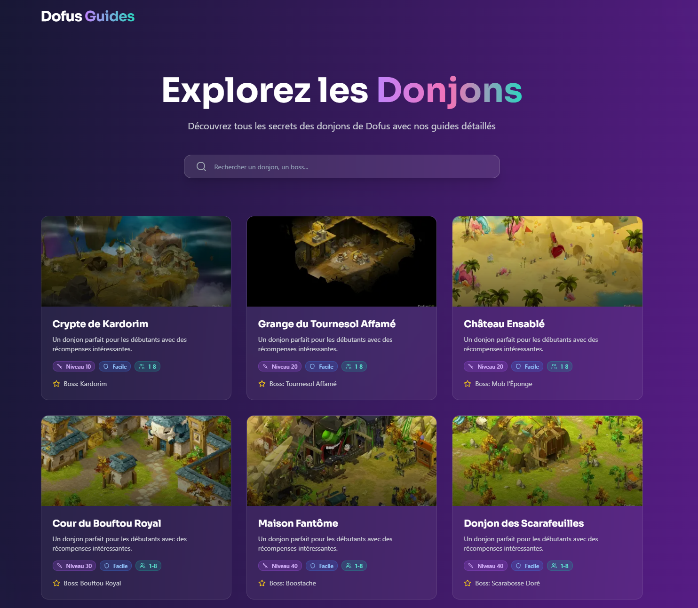
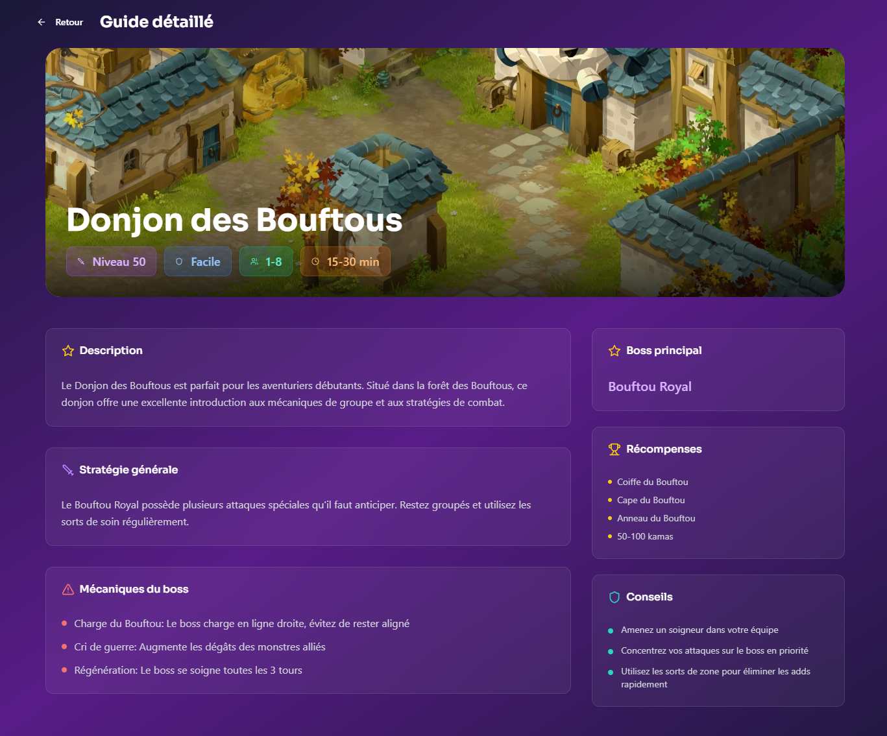

# Dofus Guides Reborn ✨

Un guide des donjons de Dofus moderne, rapide et entièrement responsive. Ce projet est une refonte complète visant à offrir une expérience utilisateur (UI/UX) propre et agréable pour parcourir les donjons du jeu.

## Aperçu 📸

<table>
  <tr>
    <td align="center"><strong>Page d'accueil</strong></td>
    <td align="center"><strong>Page de détail</strong></td>
  </tr>
  <tr>
    <td></td>
    <td></td>
  </tr>
</table>

---

## 🚀 Fonctionnalités

- **Liste complète des donjons** : Parcourez l'ensemble des donjons disponibles dans le jeu.
- **Recherche instantanée** : Filtrez les donjons en temps réel par nom.
- **Détails complets** : Accédez à une page dédiée pour chaque donjon avec les informations clés :
  - Boss et ses mécaniques
  - Stratégie générale
  - Récompenses et conseils
- **Design moderne et animé** : Une interface soignée avec des transitions fluides pour une navigation agréable.
- **Entièrement responsive** : Une expérience optimale sur ordinateur, tablette et mobile.

---

## 🛠️ Stack Technique

Ce projet est construit avec un ensemble de technologies modernes et performantes :

- **Framework** : [Next.js](https://nextjs.org/) (React)
- **Langage** : [TypeScript](https://www.typescriptlang.org/)
- **Styling** : [Tailwind CSS](https://tailwindcss.com/)
- **Composants UI** : [shadcn/ui](https://ui.shadcn.com/) (Radix UI & Lucide React)
- **Animations** : [Framer Motion](https://www.framer.com/motion/)

---

## 📊 Source des Données

Toutes les données concernant les donjons, les monstres et les images proviennent de l'API publique [dofusdb.fr](https://api.dofusdb.fr/).

---

## 🔧 Installation et Lancement Local

Pour lancer ce projet sur votre machine, suivez ces étapes :

1.  **Clonez le dépôt**

    ```bash
    git clone https://github.com/gazhrot/dofus-guides-reborn.git
    ```

2.  **Naviguez dans le dossier**

    ```bash
    cd dofus-guides-reborn
    ```

3.  **Installez les dépendances**

    ```bash
    npm install
    ```

4.  **Lancez le serveur de développement**

    ```bash
    npm run dev
    ```

5.  Ouvrez votre navigateur et allez sur [http://localhost:3000](http://localhost:3000).

---
